# Denta_3d 私有项目库

<div align="center">

> **重要提示**: 本项目为2021-2025年期间的私有项目封存库，所有代码与模型按照保密原则,彻底删除,只做历史纪念。

[](https://pytorch.org/)
[](https://developer.nvidia.com/cuda-toolkit)
[](http://www.open3d.org/)
[]()

</div>

## 项目简介

本项目是一个综合性的3D牙科应用开发项目，涵盖了从图像处理、网格生成、网格分割到纹理生成等多个领域的深度学习模型与算法实现。项目主要应用于正畸系统、牙冠生成、嵌体识别、义齿设计等口腔医学场景。

### 🌟 核心特性

<div align="center">

| 🖼️ 图像处理 | 🔲 网格生成 | ✂️ 网格分割 | 🎨 纹理生成 |
|:---:|:---:|:---:|:---:|
| 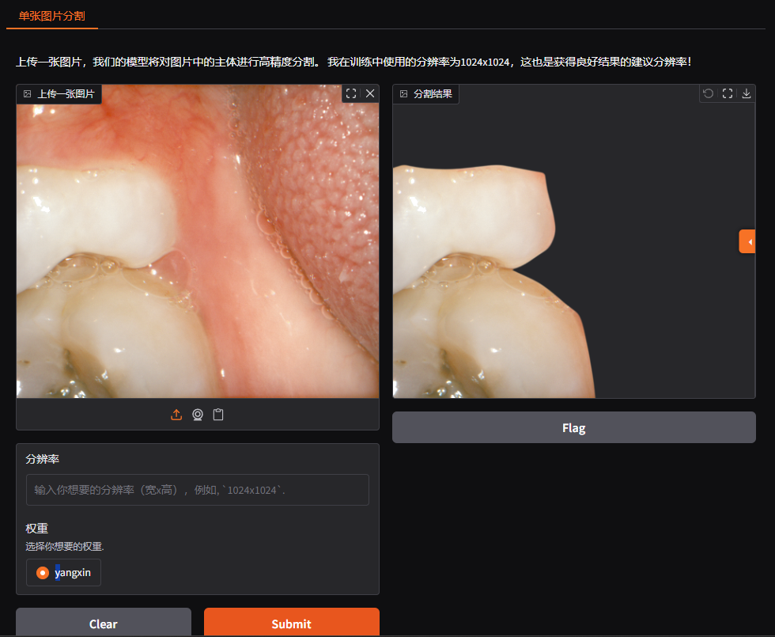 | 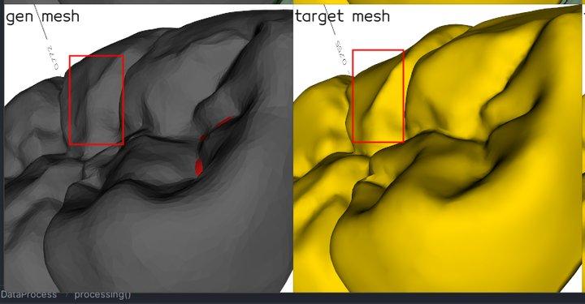 | 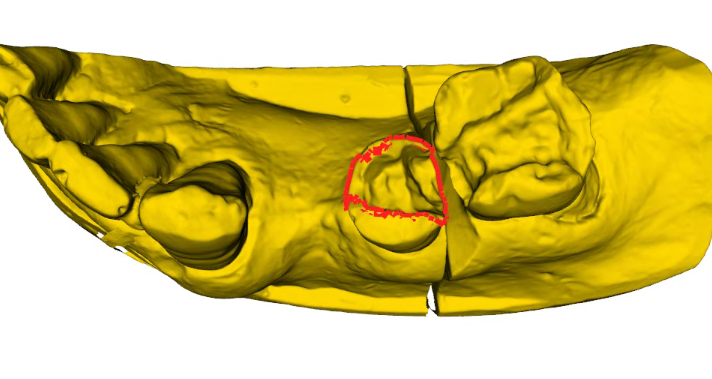 | 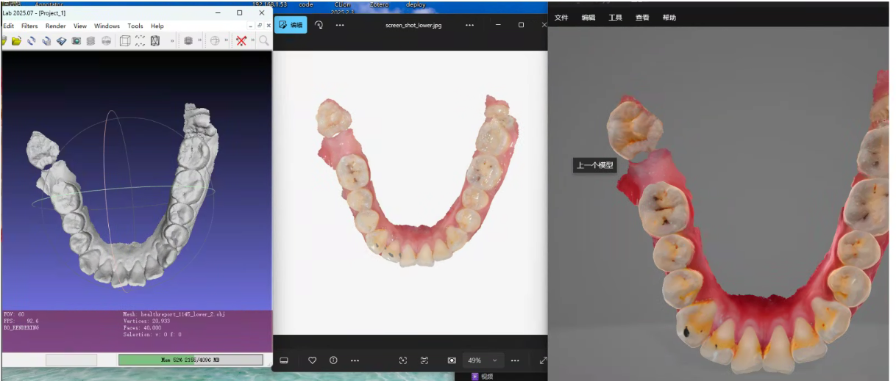 |
| 高精度图像分割 | 智能牙冠生成 | 精准边界检测 | 真实感纹理绘制 |

</div>

## 📑 目录

- [项目简介](#项目简介)
- [项目结构](#项目结构)
- [核心模块说明](#核心模块说明)
  - [1. 双目视觉匹配](#1-双目视觉匹配-binocular_vision)
  - [2. 图像分割](#2-图像分割-imageseg)
  - [3. 网格排列](#3-网格对齐-mesh_alignment)
  - [4. 网格生成](#4-网格生成-mesh_generation)
  - [5. 网格关键点检测](#5-网格关键点检测-mesh_keypoints)
  - [6. 网格分割](#6-网格分割-mesh_seg)
  - [7. 网格纹理生成](#7-网格纹理生成-mesh_texture_generation)
  - [8. 部署工具](#8-部署工具-deploy)
  - [9. 其他工具](#9-其他工具-other)
- [性能指标](#-性能指标)
- [技术栈](#️-技术栈)
- [项目应用场景](#-项目应用场景)
- [注意事项](#注意事项)

## 项目结构

```
Denta_3d_project_private/
├── binocular_vision/          # 双目视觉匹配模块
├── image_seg/                 # 图像分割模块
├── mesh_alignment/            # 网格对齐模块
├── mesh_generation/           # 网格生成模块
├── mesh_keypoints/            # 网格关键点检测模块
├── mesh_seg/                  # 网格分割模块
├── mesh_texture_generation/   # 网格纹理生成模块
├── deploy/                    # 部署相关工具
└── other/                     # 其他工具与示例
```

## 核心模块说明

### 1. 双目视觉匹配 (`binocular_vision/`)

<div align="center">

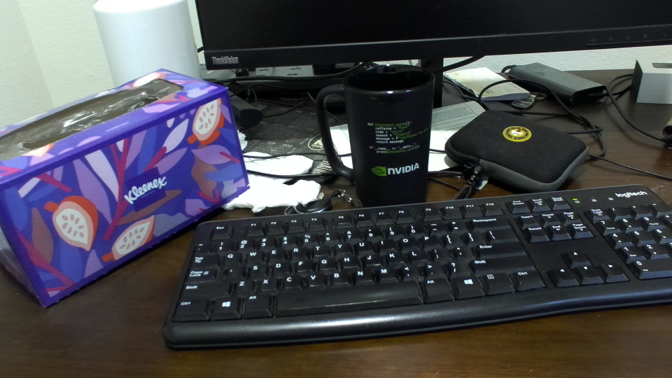

*左右视图立体匹配示例*

</div>

- **功能**: 基于Foundation Stereo模型的零样本立体匹配
- **特点**:
  - 简化模型结构，在RTX 2060上达到8-12ms推理速度
  - 适用于口腔领域的双目视觉场景
- **目录**: `foundation_stereo_simplify/`

### 2. 图像分割 (`image_seg/`)

<div align="center">


*基于BiRefNet的口腔图像分割效果展示*

</div>

- **功能**: 基于BiRefNet架构的口腔图像二分类分割
- **特点**:
  - 专注于口腔场景（齿龈区域）的主体精准分割
  - 支持口扫图片、模扫、pin杆等多种口腔图像类型
  - 经过量化、剪枝后，在GTX 1065上实现9-12ms/张分割效率（TensorRT 8.X）
- **目录**: `BiRefNet_Oral/`

### 3. 网格对齐 (`mesh_alignment/`)

<div align="center">

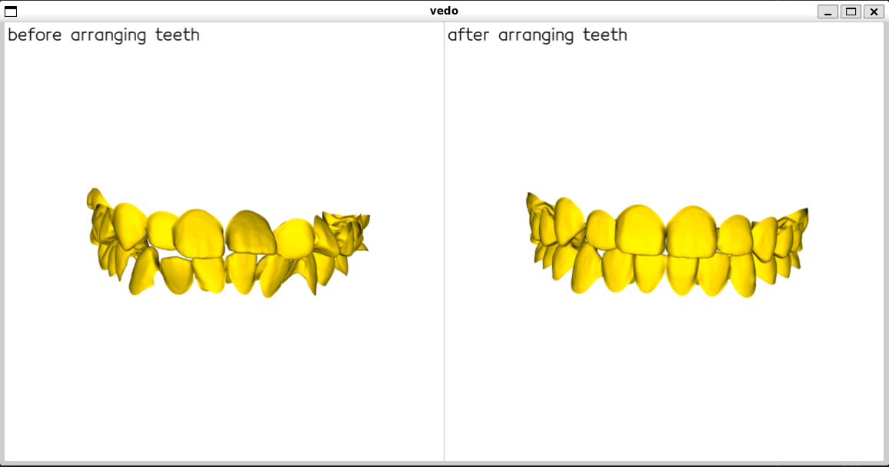

*基于LSTM的端到端牙齿自动排列*

</div>

- **功能**: 基于LSTM的端到端牙齿自动排列
- **特点**:
  - 主要用于正畸系统中的牙齿粗排列
  - 基于PyTorch和Hydra框架实现
  - 支持从原始位到目标位的4×4矩阵变换
- **目录**: `dental_alignment/`

### 4. 网格生成 (`mesh_generation/`)

#### 4.1 牙冠生成 (`crown_generation/`)

<div align="center">


*多种方案的牙冠3D网格生成效果*

</div>

- **功能**: 多种方案的牙冠3D网格生成
- **特点**:
  - 支持GAN、隐式曲面重建等多种生成方案
  - 经过多轮迭代优化，从初始的0.005s提升到3s推理速度
  - 支持添加条件特征（牙位、box、点云、文本等）
  - 集成多种编码器架构（UNet、交叉注意力等）
- **子目录**:
  - `3DMeshGenerate/`: 3D网格生成工具
  - `Deformable_CAD_Mesh/`: 可变形CAD网格生成


#### 4.2 点云重建 (`pointcloud_reconstruction/`)
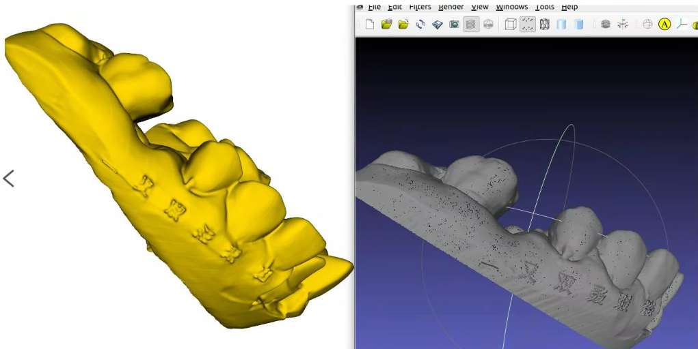
- **功能**: 基于点云的3D重建
- **特点**: 使用ShapeAttention模型进行点云到网格的重建

### 5. 网格关键点检测 (`mesh_keypoints/`)

<div align="center">

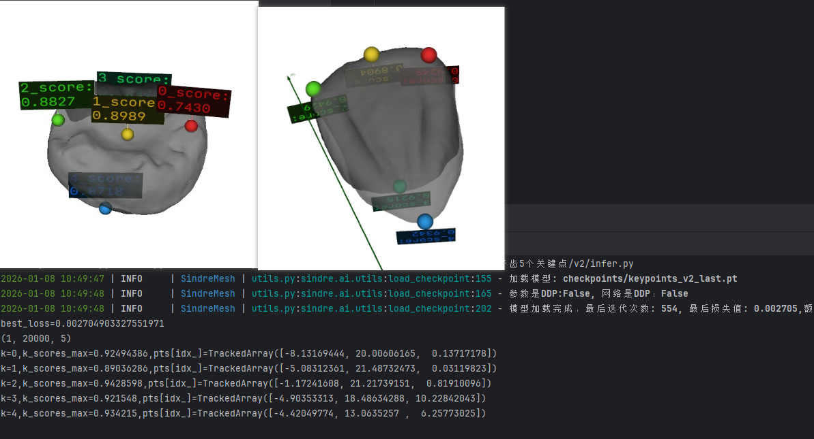

*基于点云的单颗牙齿五个关键点检测*

</div>

- **功能**: 基于点云的单颗牙齿五个关键点检测
- **目录**: `pointcloud_based_single_tooth_five_keypoints/`

### 6. 网格分割 (`mesh_seg/`)

#### 6.1 义齿分割 (`denture_seg/`)

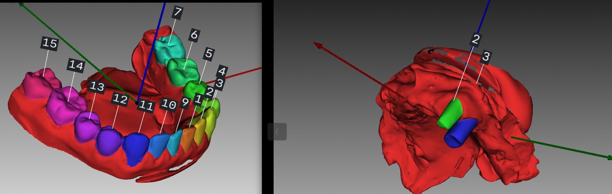
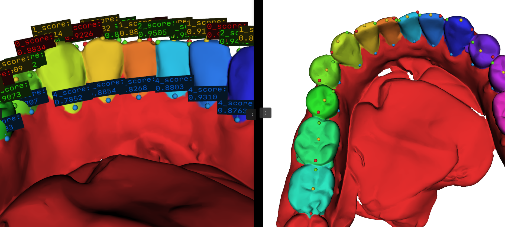

- **功能**: 全口义齿网格分割
- **特点**:
  - 集MeshSeg等多种分割方案
  - 支持多种深度学习网络架构

#### 6.2 全口义齿特征线与特征点 (`full_denture_feature_lines_points/`)

<div align="center">

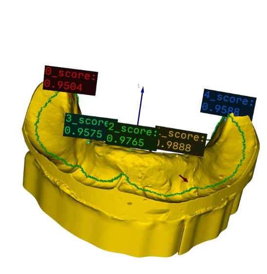

*全口义齿特征线自动识别与关键特征点定位（绿色曲线为特征线，球体为特征点）*

</div>

- **功能**: 全口义齿的特征线自动识别与关键特征点定位
- **特点**:
  - 基于点云处理与深度学习技术
  - 输出特征线、特征点及置信度得分
  - 在RTX 3090上达到120ms推理速度
  - 已上线使用

#### 6.3 嵌体分割 (`inlay_seg/`)

<div align="center">


*牙齿3D扫描模型的嵌体结构边界检测（v6版本多视图融合方案）*

</div>

- **功能**: 牙齿3D扫描模型的嵌体结构边界检测
- **特点**:
  - 支持多视图+点云融合方案（v6版本效果最优）
  - v4版本已上线，具备稳定、高效的落地能力
  - 支持Transformer和点云后处理两种方案
- **子目录**:
  - `multi_view_method/`: 多视图方法
  - `pointcloud_method/`: 点云方法

### 7. 网格纹理生成 (`mesh_texture_generation/`)

<div align="center">


*基于扩散模型的牙齿3D模型纹理生成（PBR纹理）*

</div>

- **功能**: 基于扩散模型的牙齿3D模型纹理生成
- **特点**:
  - 无需训练，使用5个约0.1B的预训练模型
  - 在RTX 3090上初始化需13s，推理需20s
  - 支持PBR纹理生成（漫反射albedo、金属粗糙度mr）
  - 模块简化至500+行代码，方便嵌入其他模型
- **目录**: `v2/`

### 8. 部署工具 (`deploy/`)

#### 8.1 PyBind11部署 (`pybind11_deploy/`)

- **功能**: 通过pybind11实现C++调用Python
- **特点**:
  - Python环境由conda pack打包分发
  - 支持CUDA加速，集成PyTorch GPU、MKL等优化库
  - 无缝在C++中执行Python代码

#### 8.2 OpenCV DNN示例 (`cpp_cv_dnn_example/`)

- **功能**: C++ + OpenCV DNN推理示例

#### 8.3 ONNX Runtime GAN示例 (`cpp_onnxruntime_gan_example/`)

- **功能**: C++ + ONNX Runtime的GAN模型推理示例

#### 8.4 其他部署工具

- `cpp_post_example/`: C++ POST请求示例
- `grid_sample_refactor/`: 3D grid_sample重构测试
- `ov_ort_comparison/`: OpenVINO与ONNX Runtime对比
- `python_env_deploy/`: Python环境部署（集成C++trimesh）

### 9. 其他工具 (`other/`)

- `DepthImageFilter/`: 深度图过滤工具（基于Open3D、Vedo）
- `flask_x3d_vedo/`: 基于Flask的3D模型Web展示工具
- `LLM_example/`: LLM应用示例（基于LangChain + ChromaDB）
- `open3d_voxel_to_np/`: Open3D体素转NumPy工具
- `sunlogin_client/`: 重新编译向日葵客户端

## ⚡ 性能指标

<div align="center">

|       模块        |   硬件配置   |             推理速度             | 状态 |
|:---------------:|:--------:|:----------------------------:|:---:|
|     双目视觉匹配      | RTX 2060 |          **8-12ms**          | ✅ 已优化 |
| 图像分割 (BiRefNet) | GTX 1065 |         **9-12ms/张**         | ✅ TensorRT加速 |
|      网格排列       | cpu(i5)  |          **3-8ms**           | ✅ 已上线 |
|    全口义齿特征识别     | RTX 3090 |          **120ms**           | ✅ 已上线 |
|      嵌体分割       | GTX 1065 |           **80ms**           | ✅ 已上线 |
|      纹理生成       | RTX 3090 | **20s** (推理) + **13s** (初始化) | ✅ 无需训练 |

</div>

## 🛠️ 技术栈

### 深度学习框架
- **PyTorch**: 主要深度学习框架
- **TensorRT**: 模型加速推理（实现9-12ms高效分割）
- **ONNX Runtime**: 跨平台推理部署
- **OpenVINO**: Intel CPU推理优化

### 3D处理库
- **Open3D**: 3D数据处理与可视化
- **Trimesh**: 网格处理与渲染（支持GLB格式）
- **Vedo**: 3D可视化与交互
- **MeshLib**: 网格曲率计算

### 计算机视觉
- **OpenCV**: 图像处理与DNN推理
- **PyTorch Vision**: 图像预处理与增强
- **DINOv2**: 强大的视觉特征提取

### 部署相关
- **PyBind11**: C++/Python无缝互操作
- **CMake**: 跨平台构建系统
- **Conda**: Python环境管理与打包

### 其他工具
- **Hydra**: 灵活配置管理
- **LangChain**: LLM应用开发框架
- **Flask**: Web服务框架
- **Diffusion Model**: 纹理生成核心技术

## 📊 项目应用场景

- ✅ **正畸系统**: 牙齿自动排列与对齐
- ✅ **牙冠设计**: AI驱动的智能牙冠生成
- ✅ **嵌体修复**: 精准的嵌体边界识别
- ✅ **义齿设计**: 全口义齿特征线与特征点识别
- ✅ **口腔扫描**: 高精度图像分割与处理
- ✅ **纹理还原**: 缺失纹理的3D模型修复

### 注意事项

1. **模型权重**: 部分模块的模型权重文件较大，需单独下载或从备份中恢复
2. **数据集**: 训练数据集通常不在本仓库中，需单独配置
3. **GPU要求**: 部分模型推理需要GPU支持，请确保CUDA环境正确配置
4. **版本兼容性**: 各模块开发时间不同，依赖库版本可能存在差异，建议使用虚拟环境隔离


**截至日期**: 2025-11
